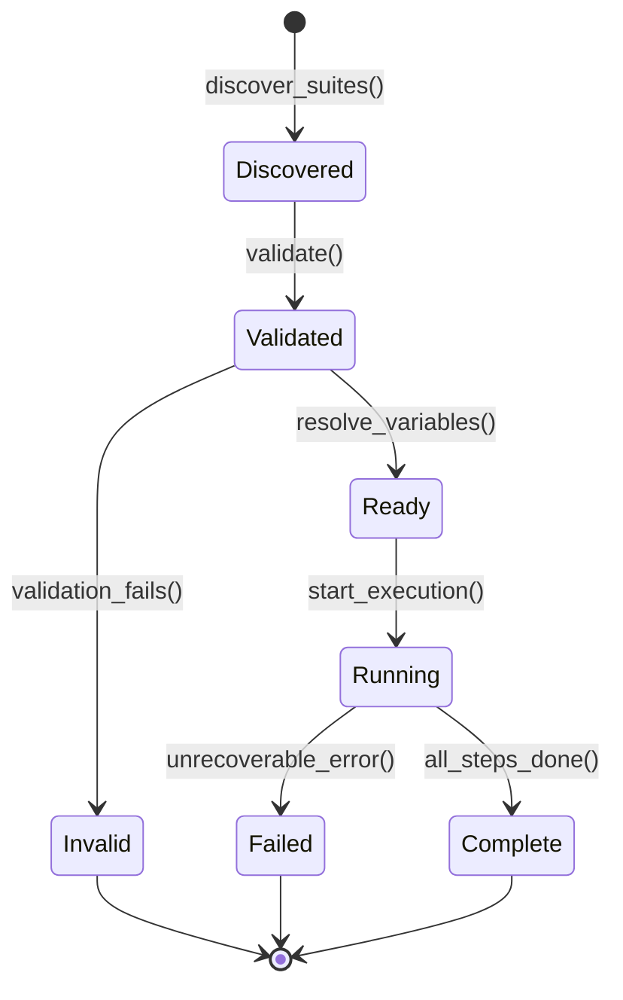
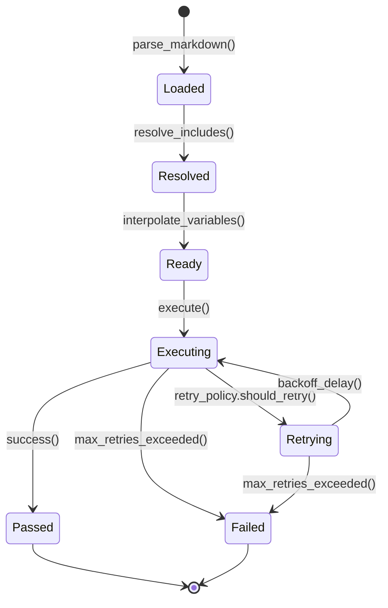

# Data Model: AI-Driven End-to-End Testing Platform

**Feature**: 001-ai-e2e-testing  
**Date**: 2025-11-13  
**Status**: Phase 1 Design

## Overview

This document defines all entities, their relationships, validation rules, and state transitions for the Familiar testing platform. These models are implementation-agnostic but will be implemented as Python dataclasses with Pydantic validation.

## Core Entities

### 1. TestSuite

**Purpose**: Represents a logical grouping of test steps with shared configuration.

**Attributes**:
- `name` (string, required): Human-readable suite name
- `path` (Path, required): File system path to suite directory
- `config` (SuiteConfig, required): Suite configuration from suite.yaml
- `steps` (List[TestStep], required): Ordered list of test steps to execute
- `metadata` (dict, optional): Additional custom metadata from YAML

**Validation Rules**:
- Name MUST be non-empty string
- Path MUST exist and contain suite.yaml
- Steps MUST be non-empty list
- Steps MUST be ordered lexicographically by filename

**Relationships**:
- Contains many TestSteps (composition)
- Has one SuiteConfig (composition)
- Produces one SuiteResult when executed

**State Lifecycle**:
```
Discovered → Validated → Ready → Running → Complete
                ↓
              Invalid (validation fails)
```

**Example**:
```python
TestSuite(
    name="User Authentication Flow",
    path=Path("familiar/auth"),
    config=SuiteConfig(timeout=60, retry_policy=...),
    steps=[
        TestStep(path="00-load-login.md", ...),
        TestStep(path="01-enter-credentials.md", ...),
    ],
)
```

---

### 2. TestStep

**Purpose**: Represents a single action or assertion in a test workflow, defined in Markdown.

**Attributes**:
- `path` (Path, required): Path to markdown file (relative to suite)
- `content` (string, required): Raw markdown content before interpolation
- `resolved_content` (string, computed): Content after variable interpolation
- `order` (int, required): Execution order (extracted from filename)
- `timeout` (int, optional): Step-specific timeout override (seconds)
- `metadata` (dict, optional): Frontmatter metadata from markdown

**Validation Rules**:
- Path MUST exist and be readable
- Content MUST be non-empty
- Order MUST be non-negative integer
- Timeout, if specified, MUST be positive integer

**Derived Properties**:
- `name` (string): Extracted from first heading in markdown (`# Step: Name`)
- `includes` (List[Path]): Parsed `!include` directives
- `variables` (Set[string]): All `${VAR}` references found in content

**Relationships**:
- Belongs to one TestSuite
- May include other TestSteps (via `!include` directive)
- Produces one StepResult when executed

**State Lifecycle**:
```
Loaded → Resolved → Ready → Executing → Complete
           ↓                      ↓
      ResolutionFailed    ExecutionFailed
```

**Example**:
```python
TestStep(
    path=Path("00-login.md"),
    content="# Step: Login\n\nNavigate to ${BASE_URL}/login...",
    order=0,
    timeout=30,
    metadata={"tags": ["auth", "critical"]},
)
```

---

### 3. SuiteConfig

**Purpose**: Configuration for test suite execution behavior, parsed from suite.yaml.

**Attributes**:
- `name` (string, required): Suite name (duplicates suite name for clarity)
- `timeout` (int, required): Total suite timeout in seconds
- `step_timeout` (int, required): Default timeout per step in seconds
- `retry_policy` (RetryPolicy, required): Retry strategy configuration
- `fuzziness` (float, required): Allowable failure percentage (0.0-1.0)
- `temperature` (float, required): AI improvisation level (0.0-1.0)
- `env` (dict[string, string], optional): Suite-specific environment variables
- `headless` (bool, optional): Override global headless browser setting
- `screenshot_on_failure` (bool, optional): Capture screenshots on failure

**Validation Rules**:
- Timeout MUST be positive integer (seconds)
- Step timeout MUST be positive integer, less than or equal to suite timeout
- Fuzziness MUST be in range [0.0, 1.0]
- Temperature MUST be in range [0.0, 1.0]
- Environment variables MUST be valid key-value pairs

**Defaults**:
```python
SuiteConfig(
    timeout=300,              # 5 minutes
    step_timeout=30,          # 30 seconds
    retry_policy=FixedRetry(max_retries=3),
    fuzziness=0.0,           # No failures allowed by default
    temperature=0.7,         # Moderate improvisation
    env={},
    headless=None,           # Use global setting
    screenshot_on_failure=True,
)
```

**Example**:
```python
SuiteConfig(
    name="Critical User Flows",
    timeout=120,
    step_timeout=30,
    retry_policy=BestOfN(n_runs=5),
    fuzziness=0.1,           # Allow 10% step failures
    temperature=0.5,
    env={"BASE_URL": "https://staging.example.com"},
)
```

---

### 4. RetryPolicy

**Purpose**: Abstract strategy for handling test step failures and retries.

**Interface** (Protocol):
- `should_retry(attempt: int, error: Exception) -> bool`
- `backoff_delay(attempt: int) -> float` (seconds)

**Implementations**:

#### FixedRetry
```python
FixedRetry(
    max_retries: int = 3,
    delay: float = 1.0,      # Seconds between retries
)
```

#### ExponentialBackoff
```python
ExponentialBackoff(
    max_retries: int = 3,
    base_delay: float = 1.0,
    max_delay: float = 30.0,
    multiplier: float = 2.0,
)
# Delays: 1s, 2s, 4s, 8s, ..., up to max_delay
```

#### BestOfN
```python
BestOfN(
    n_runs: int = 5,
    # Runs test N times, succeeds if ANY run passes
)
```

**Validation Rules**:
- max_retries MUST be non-negative integer
- Delays MUST be non-negative floats
- n_runs MUST be positive integer (>= 1)

---

### 5. TestResult

**Purpose**: Outcome of executing a single test step.

**Attributes**:
- `step` (TestStep, required): Reference to executed step
- `success` (bool, required): Whether step passed
- `duration` (float, required): Execution time in seconds
- `attempt` (int, required): Which retry attempt succeeded (1-indexed)
- `logs` (List[LogEntry], required): Timestamped execution logs
- `error` (Optional[string]): Error message if failed
- `browser_actions` (List[BrowserAction], required): Actions taken by AI agent
- `screenshot_path` (Optional[Path]): Path to failure screenshot

**Derived Properties**:
- `passed` (bool): Alias for success
- `failed` (bool): Not success
- `retry_count` (int): Number of retries (attempt - 1)

**Relationships**:
- Produced by executing one TestStep
- Belongs to one SuiteResult
- May reference screenshot artifact

**Example**:
```python
TestResult(
    step=TestStep(...),
    success=True,
    duration=12.5,
    attempt=2,  # Succeeded on 2nd try
    logs=[
        LogEntry(timestamp=..., level="INFO", message="Navigating to login"),
        LogEntry(timestamp=..., level="INFO", message="Entering credentials"),
    ],
    browser_actions=[
        BrowserAction(type="navigate", target="https://app.example.com/login"),
        BrowserAction(type="click", target="button.login"),
    ],
)
```

---

### 6. SuiteResult

**Purpose**: Aggregated results from executing a test suite.

**Attributes**:
- `suite` (TestSuite, required): Reference to executed suite
- `step_results` (List[TestResult], required): Results for each step
- `success` (bool, computed): Overall suite pass/fail status
- `duration` (float, required): Total execution time in seconds
- `started_at` (datetime, required): Suite execution start timestamp
- `completed_at` (datetime, required): Suite execution end timestamp
- `summary` (ResultSummary, computed): Aggregated statistics

**Computed Properties**:
- `passed_count` (int): Number of passed steps
- `failed_count` (int): Number of failed steps
- `skipped_count` (int): Number of skipped steps (if fuzziness allows early exit)
- `total_count` (int): Total number of steps
- `pass_rate` (float): Percentage of passed steps (0.0-1.0)

**Success Criteria**:
```python
def compute_success() -> bool:
    pass_rate = passed_count / total_count
    required_pass_rate = 1.0 - suite.config.fuzziness
    return pass_rate >= required_pass_rate
```

**Relationships**:
- Produced by executing one TestSuite
- Contains many TestResults (composition)
- May be part of TestRun (multiple suites)

**Example**:
```python
SuiteResult(
    suite=TestSuite(name="Auth Flow", ...),
    step_results=[...],
    success=True,
    duration=45.2,
    started_at=datetime(2025, 11, 13, 10, 0, 0),
    completed_at=datetime(2025, 11, 13, 10, 0, 45),
    summary=ResultSummary(
        total=5,
        passed=5,
        failed=0,
        skipped=0,
    ),
)
```

---

### 7. TestRun

**Purpose**: Represents a single invocation of the Familiar CLI, possibly executing multiple suites.

**Attributes**:
- `run_id` (string, required): Unique identifier for this run (UUID)
- `command` (string, required): CLI command that triggered run
- `suite_results` (List[SuiteResult], required): Results for all executed suites
- `success` (bool, computed): True if all suites passed
- `duration` (float, required): Total run time in seconds
- `started_at` (datetime, required): Run start timestamp
- `completed_at` (datetime, required): Run completion timestamp
- `environment` (dict, required): Snapshot of relevant environment variables
- `exit_code` (int, computed): CLI exit code (0=success, 1=failure, 2=error)

**Computed Properties**:
- `total_suites` (int): Number of suites executed
- `passed_suites` (int): Number of suites that passed
- `failed_suites` (int): Number of suites that failed
- `total_steps` (int): Sum of all steps across all suites
- `passed_steps` (int): Sum of all passed steps
- `failed_steps` (int): Sum of all failed steps

**Relationships**:
- Contains many SuiteResults (composition)
- Produces one or more OutputArtifacts (JSON, JUnit XML, screenshots)

**Example**:
```python
TestRun(
    run_id="550e8400-e29b-41d4-a716-446655440000",
    command="familiar run --all --format junit",
    suite_results=[...],
    success=True,
    duration=120.5,
    started_at=datetime(2025, 11, 13, 10, 0, 0),
    completed_at=datetime(2025, 11, 13, 10, 2, 0),
    environment={
        "FAMILIAR_HEADLESS": "true",
        "BASE_URL": "https://staging.example.com",
    },
)
```

---

### 8. LogEntry

**Purpose**: Single timestamped log message from test execution.

**Attributes**:
- `timestamp` (datetime, required): When log was created
- `level` (LogLevel, required): DEBUG | INFO | WARNING | ERROR
- `message` (string, required): Log message content
- `context` (dict, optional): Additional structured context (step name, suite name, etc.)
- `source` (string, required): Where log originated (familiar, browser-use, playwright)

**Validation Rules**:
- Message MUST be non-empty
- Level MUST be valid enum value

**Example**:
```python
LogEntry(
    timestamp=datetime(2025, 11, 13, 10, 0, 5),
    level=LogLevel.INFO,
    message="Step completed successfully",
    context={
        "step": "00-login.md",
        "suite": "auth-flow",
        "duration": 5.2,
    },
    source="familiar.executor",
)
```

---

### 9. BrowserAction

**Purpose**: Record of a single action taken by the AI agent in the browser.

**Attributes**:
- `type` (ActionType, required): navigate | click | type | scroll | wait | screenshot
- `target` (string, optional): Element selector or URL
- `value` (string, optional): For type actions, the text entered
- `timestamp` (datetime, required): When action occurred
- `success` (bool, required): Whether action succeeded
- `error` (Optional[string]): Error message if failed

**Action Types**:
```python
class ActionType(Enum):
    NAVIGATE = "navigate"      # Navigate to URL
    CLICK = "click"           # Click element
    TYPE = "type"             # Type text into element
    SCROLL = "scroll"         # Scroll page/element
    WAIT = "wait"             # Wait for condition
    SCREENSHOT = "screenshot" # Capture screenshot
    EVALUATE = "evaluate"     # Execute JavaScript
```

**Example**:
```python
BrowserAction(
    type=ActionType.CLICK,
    target="button[data-testid='submit']",
    timestamp=datetime(2025, 11, 13, 10, 0, 5),
    success=True,
)
```

---

## Entity Relationships Diagram

```
TestRun (1)
  └─── contains ───> SuiteResult (many)
                        ├─── from ───> TestSuite (1)
                        │                 ├─── has ───> SuiteConfig (1)
                        │                 │                └─── uses ───> RetryPolicy (1)
                        │                 └─── contains ───> TestStep (many)
                        └─── contains ───> TestResult (many)
                                              ├─── from ───> TestStep (1)
                                              ├─── contains ───> LogEntry (many)
                                              └─── contains ───> BrowserAction (many)
```

## Validation Rules Summary

### Suite-Level Validation

1. **Suite Directory Structure**:
   - MUST contain `suite.yaml` file
   - MUST contain at least one step file (`*.md`)
   - Step files MUST follow naming convention: `NN-name.md` where NN is 00-99

2. **Suite YAML Schema**:
   - All required fields present (name, timeout, step_timeout, retry_policy)
   - Numeric values within valid ranges
   - retry_policy type must be valid enum value

3. **Variable Resolution**:
   - All `${VAR}` references MUST be resolvable from environment
   - Circular includes (A includes B, B includes A) MUST be detected and rejected

### Step-Level Validation

1. **Markdown Format**:
   - MUST have at least one heading (step name)
   - `!include` directives MUST reference existing files
   - Variable syntax MUST be valid (`${VAR}` or `${VAR:-default}`)

2. **Execution Validation**:
   - Step timeout MUST NOT exceed suite timeout
   - Total estimated time (steps × step_timeout) SHOULD NOT exceed suite timeout (warning)

### Result Validation

1. **Fuzziness Calculation**:
   - Pass rate = (passed_steps / total_steps)
   - Required pass rate = (1.0 - fuzziness)
   - Suite succeeds if: pass_rate >= required_pass_rate

2. **Retry Accounting**:
   - Each retry attempt counted separately in logs
   - Final result reflects successful attempt
   - Total duration includes all retry attempts

## State Transitions

### TestSuite Lifecycle



### TestStep Lifecycle



## Implementation Notes

### Python Dataclass Example

```python
from dataclasses import dataclass
from pathlib import Path
from typing import List, Optional
from datetime import datetime
from pydantic import BaseModel, Field, validator

class SuiteConfig(BaseModel):
    """Suite configuration with Pydantic validation."""
    name: str = Field(min_length=1)
    timeout: int = Field(gt=0)
    step_timeout: int = Field(gt=0)
    fuzziness: float = Field(ge=0.0, le=1.0)
    temperature: float = Field(ge=0.0, le=1.0)
    env: dict[str, str] = Field(default_factory=dict)
    
    @validator('step_timeout')
    def step_timeout_must_not_exceed_suite_timeout(cls, v, values):
        if 'timeout' in values and v > values['timeout']:
            raise ValueError('step_timeout cannot exceed suite timeout')
        return v

@dataclass
class TestStep:
    """Test step with computed properties."""
    path: Path
    content: str
    order: int
    timeout: Optional[int] = None
    metadata: dict = field(default_factory=dict)
    
    @property
    def name(self) -> str:
        """Extract step name from first heading."""
        for line in self.content.split('\n'):
            if line.startswith('# '):
                return line[2:].strip()
        return self.path.stem
    
    @property
    def variables(self) -> set[str]:
        """Extract all ${VAR} references."""
        import re
        pattern = r'\$\{([A-Z_][A-Z0-9_]*)(:-[^}]*)?\}'
        return set(re.findall(pattern, self.content))
```

### Validation Workflow

```python
async def validate_suite(suite: TestSuite) -> ValidationResult:
    """Validate suite and all its steps."""
    errors = []
    warnings = []
    
    # Validate config
    try:
        suite.config.model_validate(suite.config)
    except ValidationError as e:
        errors.append(f"Invalid config: {e}")
    
    # Validate steps
    for step in suite.steps:
        if not step.path.exists():
            errors.append(f"Step file not found: {step.path}")
        
        # Check variable resolution
        unresolved = step.variables - set(os.environ.keys())
        if unresolved:
            errors.append(f"Unresolved variables in {step.path}: {unresolved}")
    
    # Check time estimates
    estimated_time = len(suite.steps) * suite.config.step_timeout
    if estimated_time > suite.config.timeout:
        warnings.append(f"Estimated time ({estimated_time}s) exceeds timeout ({suite.config.timeout}s)")
    
    return ValidationResult(
        valid=len(errors) == 0,
        errors=errors,
        warnings=warnings,
    )
```

## Next Steps

Data model defined. Proceed to:
- ✅ Create contract specifications in `contracts/`
- ✅ Create `quickstart.md` with practical examples
- ✅ Update agent context

**Status**: ✅ Phase 1 Data Model Complete

