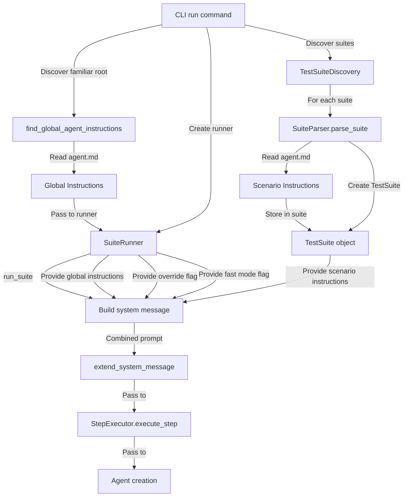

# Data Model: Agent Instructions

**Branch**: `007-agent-instructions` | **Date**: 2025-11-14 | **Spec**: [spec.md](spec.md)  
**Input**: Feature requirements and research findings

## 1. Modified Entities

### 1.1. `TestSuite` (src/familiar/models/suite.py)

**Current Definition**:
```python
@dataclass
class TestSuite:
    """A test suite with configuration and steps."""
    
    name: str
    path: Path
    config: SuiteConfig
    steps: List[Any] = field(default_factory=list)  # List[TestStep]
    metadata: Dict[str, Any] = field(default_factory=dict)
```

**Modified Definition**:
```python
@dataclass
class TestSuite:
    """A test suite with configuration and steps."""
    
    name: str
    path: Path
    config: SuiteConfig
    steps: List[Any] = field(default_factory=list)  # List[TestStep]
    metadata: Dict[str, Any] = field(default_factory=dict)
    agent_instructions: Optional[str] = None  # NEW: Scenario-level agent instructions
```

**Change Summary**:
- **Added Field**: `agent_instructions: Optional[str] = None`
- **Purpose**: Store scenario-level agent instructions read from `agent.md`
- **Default**: `None` (backward compatible)
- **Type**: Optional string (None if no agent.md found)

**Backward Compatibility**: ✅ **Fully Compatible**
- Default value is `None`
- Existing code constructing `TestSuite` without this field will work
- Optional field doesn't break Pydantic or dataclass contracts

---

### 1.2. `SuiteRunner` (src/familiar/core/runner.py)

**Current `__init__`**:
```python
def __init__(self, headless: bool = True, fast_mode: bool = False):
    """Initialize the suite runner.
    
    Args:
        headless: Whether to run browser in headless mode.
        fast_mode: Whether to enable speed optimizations (flash mode).
    """
    self.headless = headless
    self.fast_mode = fast_mode
```

**Modified `__init__`**:
```python
def __init__(
    self,
    headless: bool = True,
    fast_mode: bool = False,
    scenario_agent_override: bool = False,  # NEW
    global_agent_instructions: Optional[str] = None,  # NEW
):
    """Initialize the suite runner.
    
    Args:
        headless: Whether to run browser in headless mode.
        fast_mode: Whether to enable speed optimizations (flash mode).
        scenario_agent_override: Whether to use only scenario-level agent instructions.
        global_agent_instructions: Global agent instructions from familiar root.
    """
    self.headless = headless
    self.fast_mode = fast_mode
    self.scenario_agent_override = scenario_agent_override  # NEW
    self.global_agent_instructions = global_agent_instructions  # NEW
```

**Change Summary**:
- **Added Parameter**: `scenario_agent_override: bool = False`
- **Added Parameter**: `global_agent_instructions: Optional[str] = None`
- **Purpose**: Store global configuration for agent instructions
- **Defaults**: Both have default values (backward compatible)

**Backward Compatibility**: ✅ **Fully Compatible**
- Both new parameters have default values
- Existing code creating `SuiteRunner()` will work unchanged

---

## 2. New Entities

### 2.1. System Message Builder Function

**Function**: `build_system_message()` (new, in `src/familiar/core/runner.py`)

```python
def build_system_message(
    fast_mode: bool,
    global_agent_md: Optional[str],
    scenario_agent_md: Optional[str],
    override_flag: bool
) -> Optional[str]:
    """Build combined system message from fast mode and agent instructions.
    
    Combines components in priority order:
    1. Fast mode prompt (behavioral instructions)
    2. Global agent instructions (app-wide context)
    3. Scenario agent instructions (test-specific context)
    
    Args:
        fast_mode: Whether fast mode is enabled.
        global_agent_md: Global agent instructions content (or None).
        scenario_agent_md: Scenario agent instructions content (or None).
        override_flag: If True, ignore global_agent_md when scenario_agent_md exists.
        
    Returns:
        Combined system message string, or None if no components present.
    """
```

**Purpose**: Pure function that combines system message components based on configuration.

**Properties**:
- **Pure function**: No side effects, deterministic
- **Testable**: Easy to unit test all combinations
- **Reusable**: Can be used anywhere system message needed

---

### 2.2. Agent Instructions Reader Function

**Function**: `read_agent_instructions()` (new, in `src/familiar/utils/` or `src/familiar/core/parser.py`)

```python
def read_agent_instructions(path: Path) -> Optional[str]:
    """Read agent instructions from file with robust error handling.
    
    Args:
        path: Path to agent.md file
        
    Returns:
        File content as string, or None if file doesn't exist or can't be read
        
    Error Handling:
        - File not found: Returns None (no warning)
        - Encoding error: Returns None with WARNING log
        - Permission error: Returns None with WARNING log
        - Empty file: Returns None (no warning)
        - Large file (>100KB): Returns content with WARNING log
    """
```

**Purpose**: Centralized file reading with encoding fallback and error handling.

---

## 3. Data Flow



---

## 4. State Transitions

**Not Applicable**: Agent instructions are immutable data loaded once and passed through the system.

---

## 5. Validation Rules

### 5.1. TestSuite.agent_instructions

| Rule | Validation | Error Handling |
|------|------------|----------------|
| Type | `Optional[str]` | Type-checked by Python/dataclass |
| Default | `None` | Automatically applied |
| Empty string | Treated as None | Convert `""` to `None` in parser |
| Whitespace only | Treated as None | Strip and convert to `None` if empty |

**Implementation**:
```python
# In parser after reading file
agent_content = read_agent_instructions(agent_file)
if agent_content:
    agent_content = agent_content.strip()
    if not agent_content:  # Empty after stripping
        agent_content = None
```

### 5.2. SuiteRunner parameters

| Parameter | Type | Default | Validation |
|-----------|------|---------|------------|
| `scenario_agent_override` | `bool` | `False` | Type-checked |
| `global_agent_instructions` | `Optional[str]` | `None` | Type-checked |

No runtime validation needed beyond type checking.

---

## 6. Data Persistence

**Not Applicable**: Agent instructions are ephemeral (read from files at runtime, not persisted).

---

## 7. Example Data

### 7.1. TestSuite with Agent Instructions

```python
suite = TestSuite(
    name="Checkout Flow",
    path=Path("familiar/checkout-flow"),
    config=SuiteConfig(...),
    steps=[step1, step2, step3],
    agent_instructions="""
You are testing an e-commerce checkout flow. Important context:

- Payment processing uses Stripe test mode
- The shipping address form has custom validation
- There's a promotional code field that may or may not be visible
- The "Place Order" button is disabled until all required fields are filled
"""
)
```

### 7.2. System Message Components

**Fast Mode Prompt**:
```text
Speed optimization instructions:
- Be extremely concise and direct in your responses
- Get to the goal as quickly as possible
- Use multi-action sequences whenever possible to reduce steps
```

**Global Agent Instructions** (from `familiar/agent.md`):
```text
You are testing a React application with the following characteristics:

- Uses React Router for navigation
- All forms have client-side validation
- Loading states are indicated by spinner icons
- Error messages appear as red text below form fields
```

**Scenario Agent Instructions** (from `familiar/checkout-flow/agent.md`):
```text
Checkout flow specific notes:

- Cart must have items before accessing checkout
- Credit card field uses Stripe Elements (iframe)
- Address autocomplete is enabled via Google Places API
```

**Combined System Message** (fast_mode=True, override=False):
```text
Speed optimization instructions:
- Be extremely concise and direct in your responses
- Get to the goal as quickly as possible
- Use multi-action sequences whenever possible to reduce steps

You are testing a React application with the following characteristics:

- Uses React Router for navigation
- All forms have client-side validation
- Loading states are indicated by spinner icons
- Error messages appear as red text below form fields

Checkout flow specific notes:

- Cart must have items before accessing checkout
- Credit card field uses Stripe Elements (iframe)
- Address autocomplete is enabled via Google Places API
```

---

## 8. Migration Strategy

**Not Required**: Feature is additive with full backward compatibility.

Existing code will work without any changes:
- `TestSuite` with `agent_instructions=None` (default)
- `SuiteRunner` with default parameters
- No breaking changes to any public APIs

---

## Summary

**Model Changes**: 2 entities modified, 2 functions added  
**Backward Compatibility**: ✅ **100% Compatible**  
**Validation**: Minimal (type checking + empty string handling)  
**Complexity**: Low (simple data fields and pure functions)

