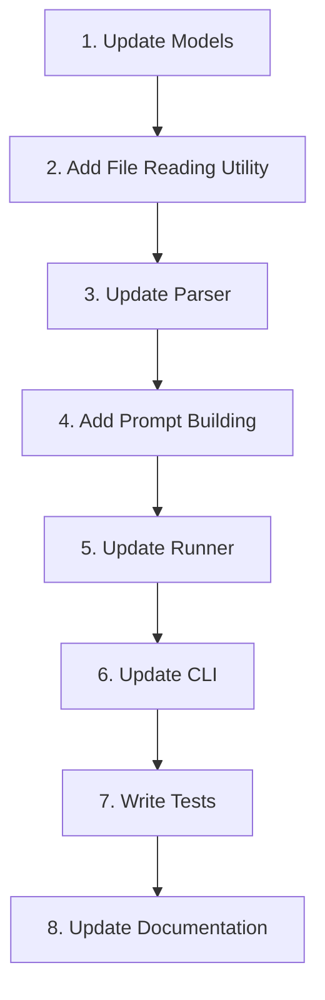

# Quick Start: Agent Instructions Implementation Guide

**Branch**: `007-agent-instructions` | **Date**: 2025-11-14 | **Spec**: [spec.md](spec.md)  
**Prerequisites**: plan.md (required), research.md, data-model.md, contracts/

## 1. Overview

This guide provides step-by-step instructions for implementing the agent instructions feature. Follow the order sequentially for a smooth implementation.

**Estimated Time**: 4-6 hours  
**Complexity**: Low-Medium  
**Files to Modify**: 5 files  
**New Functions**: 2 functions  
**Tests to Add**: ~15 tests

## 2. Prerequisites

Before starting implementation:

- ✅ All Phase 0-1 design artifacts completed
- ✅ Constitution check passed
- ✅ Git branch `007-agent-instructions` created
- ✅ Current test suite passing (103 tests)

## 3. Implementation Order



## 4. Step-by-Step Implementation

### Step 1: Update Models (15 minutes)

**File**: `src/familiar/models/suite.py`

**Add field to TestSuite**:
```python
@dataclass
class TestSuite:
    """A test suite with configuration and steps."""
    
    name: str
    path: Path
    config: SuiteConfig
    steps: List[Any] = field(default_factory=list)
    metadata: Dict[str, Any] = field(default_factory=dict)
    agent_instructions: Optional[str] = None  # ADD THIS LINE
```

**Verify**: Run existing tests to ensure backward compatibility:
```bash
pytest tests/unit/test_models.py -v
```

---

### Step 2: Add File Reading Utility (30 minutes)

**File**: `src/familiar/core/parser.py` (add at module level)

**Implementation**:
```python
import logging
from pathlib import Path
from typing import Optional

logger = logging.getLogger(__name__)


def read_agent_instructions(path: Path) -> Optional[str]:
    """Read agent instructions from file with robust error handling.
    
    Args:
        path: Path to agent.md file
        
    Returns:
        File content as string, or None if file doesn't exist or can't be read
    """
    if not path.exists():
        return None
    
    # Check file size
    try:
        file_size = path.stat().st_size
        if file_size == 0:
            return None  # Empty file
        
        if file_size > 100 * 1024:  # 100KB
            logger.warning(
                f"agent.md at {path} is large ({file_size / 1024:.1f}KB). "
                "Consider keeping instructions concise for better results."
            )
    except OSError as e:
        logger.warning(f"Could not stat agent.md at {path}: {e}")
        return None
    
    # Read file with encoding fallback
    try:
        content = path.read_text(encoding='utf-8')
        # Strip whitespace and return None if empty
        content = content.strip()
        return content if content else None
    except UnicodeDecodeError:
        try:
            content = path.read_text(encoding='latin-1').strip()
            if content:
                logger.warning(f"agent.md at {path} is not UTF-8, used latin-1 fallback")
                return content
            return None
        except Exception as e:
            logger.warning(f"Could not read agent.md at {path}: {e}")
            return None
    except Exception as e:
        logger.warning(f"Could not read agent.md at {path}: {e}")
        return None
```

**Verify**: Write a quick test:
```bash
python -c "
from pathlib import Path
from familiar.core.parser import read_agent_instructions

# Test with non-existent file
result = read_agent_instructions(Path('nonexistent.md'))
assert result is None
print('✓ File reading utility working')
"
```

---

### Step 3: Update Parser (30 minutes)

**File**: `src/familiar/core/parser.py`

**Modify `parse_suite` method** (around line 25):

```python
def parse_suite(self, suite_path: Path) -> TestSuite:
    """Parse a test suite from a directory."""
    # ... existing code for config parsing ...
    
    # Parse test steps
    steps = self._parse_steps(suite_path)
    
    # NEW: Read agent instructions if present
    agent_file = suite_path / "agent.md"
    agent_instructions = read_agent_instructions(agent_file)
    
    return TestSuite(
        name=config.name,
        path=suite_path,
        config=config,
        steps=steps,
        agent_instructions=agent_instructions,  # ADD THIS
    )
```

**Verify**: Test parsing with and without agent.md:
```bash
pytest tests/unit/test_parser.py -v
```

---

### Step 4: Add Prompt Building Function (30 minutes)

**File**: `src/familiar/core/runner.py`

**Add function at module level** (after SPEED_OPTIMIZATION_PROMPT):

```python
def build_system_message(
    fast_mode: bool,
    global_agent_md: Optional[str],
    scenario_agent_md: Optional[str],
    override_flag: bool
) -> Optional[str]:
    """Build combined system message from fast mode and agent instructions.
    
    Combines components in priority order:
    1. Fast mode prompt (behavioral instructions)
    2. Global agent instructions (app-wide context)
    3. Scenario agent instructions (test-specific context)
    
    Args:
        fast_mode: Whether fast mode is enabled.
        global_agent_md: Global agent instructions content (or None).
        scenario_agent_md: Scenario agent instructions content (or None).
        override_flag: If True, ignore global_agent_md when scenario_agent_md exists.
        
    Returns:
        Combined system message string, or None if no components present.
    """
    components = []
    
    # 1. Behavioral instructions (fast mode)
    if fast_mode:
        components.append(SPEED_OPTIMIZATION_PROMPT)
    
    # 2. General context (global agent.md)
    if not override_flag and global_agent_md:
        components.append(global_agent_md)
    
    # 3. Specific context (scenario agent.md)
    if scenario_agent_md:
        components.append(scenario_agent_md)
    
    return "\n\n".join(components) if components else None
```

**Verify**: Write inline test:
```python
# Quick verification
result = build_system_message(
    fast_mode=True,
    global_agent_md="Global",
    scenario_agent_md="Scenario",
    override_flag=False
)
assert "Global" in result
assert "Scenario" in result
print("✓ Prompt building working")
```

---

### Step 5: Update Runner (45 minutes)

**File**: `src/familiar/core/runner.py`

**Update `__init__` method** (around line 35):

```python
def __init__(
    self,
    headless: bool = True,
    fast_mode: bool = False,
    scenario_agent_override: bool = False,  # ADD THIS
    global_agent_instructions: Optional[str] = None,  # ADD THIS
):
    """Initialize the suite runner.
    
    Args:
        headless: Whether to run browser in headless mode.
        fast_mode: Whether to enable speed optimizations (flash mode).
        scenario_agent_override: Whether to use only scenario-level agent instructions.
        global_agent_instructions: Global agent instructions from familiar root.
    """
    self.headless = headless
    self.fast_mode = fast_mode
    self.scenario_agent_override = scenario_agent_override  # ADD THIS
    self.global_agent_instructions = global_agent_instructions  # ADD THIS
```

**Update `run_suite` method** (around line 108):

Replace this section:
```python
# OLD CODE:
flash_mode = self.fast_mode
extend_system_message = SPEED_OPTIMIZATION_PROMPT if self.fast_mode else None
```

With:
```python
# NEW CODE:
flash_mode = self.fast_mode
extend_system_message = build_system_message(
    fast_mode=self.fast_mode,
    global_agent_md=self.global_agent_instructions,
    scenario_agent_md=suite.agent_instructions,
    override_flag=self.scenario_agent_override,
)
```

**Verify**: Check that tests still pass:
```bash
pytest tests/integration/test_runner.py -v
```

---

### Step 6: Update CLI (30 minutes)

**File**: `src/familiar/cli/main.py`

**Add flag to run command** (around line 30):

```python
@click.option(
    "--fast",
    is_flag=True,
    help="Enable speed optimizations (flash mode, reduced wait times). May reduce reliability for complex scenarios.",
)
@click.option(
    "--scenario-agent-override",  # ADD THIS ENTIRE BLOCK
    is_flag=True,
    default=False,
    help="Use only scenario-level agent.md instructions, ignoring global agent.md.",
)
def run(
    suite_path_or_name: Optional[str],
    all: bool,
    format: str,
    headless: bool,
    verbose: bool,
    fast: bool,
    scenario_agent_override: bool,  # ADD THIS PARAMETER
) -> None:
    """Run test suites."""
    # ... pass to run_suite_command ...
```

**File**: `src/familiar/cli/run.py`

**Add global agent discovery** (in `run_suite_command`, around line 170):

```python
def run_suite_command(
    suite_path_or_name: Optional[str],
    run_all: bool,
    format: str,
    headless: bool,
    verbose: bool,
    fast_mode: bool,
    scenario_agent_override: bool,  # ADD THIS PARAMETER
):
    """Execute test suite(s) with CLI options."""
    # ... existing setup code ...
    
    # NEW: Discover global agent instructions
    root_dir = Path("./familiar")  # Or from suite discovery
    from familiar.core.parser import read_agent_instructions
    global_agent_instructions = read_agent_instructions(root_dir / "agent.md")
    
    # Create runner
    runner = SuiteRunner(
        headless=headless,
        fast_mode=fast_mode,
        scenario_agent_override=scenario_agent_override,  # ADD THIS
        global_agent_instructions=global_agent_instructions,  # ADD THIS
    )
```

**Verify**: Test CLI accepts new flag:
```bash
familiar run --help | grep scenario-agent-override
```

---

### Step 7: Write Tests (2-3 hours)

**Create test file**: `tests/unit/test_agent_instructions.py`

```python
"""Unit tests for agent instructions feature."""
import pytest
from pathlib import Path
from familiar.core.runner import build_system_message, SPEED_OPTIMIZATION_PROMPT
from familiar.core.parser import read_agent_instructions


class TestBuildSystemMessage:
    """Tests for system message building."""
    
    def test_no_components(self):
        """Test with no components returns None."""
        result = build_system_message(
            fast_mode=False,
            global_agent_md=None,
            scenario_agent_md=None,
            override_flag=False,
        )
        assert result is None
    
    def test_fast_mode_only(self):
        """Test with only fast mode."""
        result = build_system_message(
            fast_mode=True,
            global_agent_md=None,
            scenario_agent_md=None,
            override_flag=False,
        )
        assert result == SPEED_OPTIMIZATION_PROMPT
    
    def test_global_only(self):
        """Test with only global agent.md."""
        result = build_system_message(
            fast_mode=False,
            global_agent_md="Global context",
            scenario_agent_md=None,
            override_flag=False,
        )
        assert result == "Global context"
    
    def test_scenario_only(self):
        """Test with only scenario agent.md."""
        result = build_system_message(
            fast_mode=False,
            global_agent_md=None,
            scenario_agent_md="Scenario context",
            override_flag=False,
        )
        assert result == "Scenario context"
    
    def test_combined_no_override(self):
        """Test combining global and scenario without override."""
        result = build_system_message(
            fast_mode=False,
            global_agent_md="Global context",
            scenario_agent_md="Scenario context",
            override_flag=False,
        )
        assert result == "Global context\n\nScenario context"
    
    def test_combined_with_override(self):
        """Test override ignores global."""
        result = build_system_message(
            fast_mode=False,
            global_agent_md="Global context",
            scenario_agent_md="Scenario context",
            override_flag=True,
        )
        assert result == "Scenario context"
    
    def test_all_components(self):
        """Test fast mode + global + scenario."""
        result = build_system_message(
            fast_mode=True,
            global_agent_md="Global context",
            scenario_agent_md="Scenario context",
            override_flag=False,
        )
        expected = f"{SPEED_OPTIMIZATION_PROMPT}\n\nGlobal context\n\nScenario context"
        assert result == expected


class TestReadAgentInstructions:
    """Tests for file reading."""
    
    def test_file_not_found(self, tmp_path):
        """Test with non-existent file."""
        path = tmp_path / "nonexistent.md"
        result = read_agent_instructions(path)
        assert result is None
    
    def test_file_exists(self, tmp_path):
        """Test reading valid file."""
        path = tmp_path / "agent.md"
        path.write_text("Test instructions", encoding='utf-8')
        result = read_agent_instructions(path)
        assert result == "Test instructions"
    
    def test_empty_file(self, tmp_path):
        """Test empty file returns None."""
        path = tmp_path / "agent.md"
        path.write_text("", encoding='utf-8')
        result = read_agent_instructions(path)
        assert result is None
    
    def test_whitespace_only(self, tmp_path):
        """Test whitespace-only file returns None."""
        path = tmp_path / "agent.md"
        path.write_text("   \n\n  ", encoding='utf-8')
        result = read_agent_instructions(path)
        assert result is None
```

**Run tests**:
```bash
pytest tests/unit/test_agent_instructions.py -v
```

**Add integration tests**: `tests/integration/test_agent_instructions_integration.py`

---

### Step 8: Update Documentation (30 minutes)

**File**: `README.md`

Add to CLI reference section:

```markdown
#### `--scenario-agent-override`

Use only scenario-level agent.md instructions, ignoring global agent.md.

```bash
familiar run tests/my-suite --scenario-agent-override
```

Has no effect if scenario-level agent.md doesn't exist.
```

**File**: `docs/configuration.md`

Add new section on agent instructions with examples.

**Add example**: `examples/basic-login/agent.md`

```markdown
You are testing a basic login flow. Context:

- Username field: accepts email format
- Password field: minimum 8 characters
- Submit button: enabled only when both fields filled
- Error messages appear below respective fields
```

---

## 5. Testing Checklist

Before considering implementation complete:

- [ ] All existing tests pass (103 tests)
- [ ] New unit tests pass (build_system_message)
- [ ] New unit tests pass (read_agent_instructions)
- [ ] New integration tests pass (agent.md combinations)
- [ ] Contract tests pass (CLI flag accepted)
- [ ] Manual test: Run with agent.md at global level
- [ ] Manual test: Run with agent.md at scenario level
- [ ] Manual test: Run with both + override flag
- [ ] Manual test: Run with fast mode + agent.md
- [ ] Coverage for new code at 100%

---

## 6. Validation Commands

```bash
# 1. Run all tests
pytest tests/ -v

# 2. Check coverage
pytest --cov=src/familiar/core/runner --cov=src/familiar/core/parser tests/

# 3. Lint check
ruff check src/

# 4. Type check
mypy src/

# 5. Format code
ruff format src/ tests/

# 6. Test CLI
familiar run --help | grep scenario-agent-override
```

---

## 7. Common Issues & Solutions

### Issue: Tests fail after model update
**Solution**: Ensure `agent_instructions=None` default is set

### Issue: File encoding errors
**Solution**: Verify fallback to latin-1 is working, check logs

### Issue: Override flag not working
**Solution**: Check that flag is passed through all layers (CLI → runner)

### Issue: System message not combining correctly
**Solution**: Debug `build_system_message` with print statements

---

## 8. Rollback Strategy

If issues arise:

```bash
# Revert last commit
git revert HEAD --no-edit

# Or reset to before implementation
git reset --hard origin/007-agent-instructions

# Re-run tests to confirm
pytest tests/ -v
```

---

## 9. Completion Criteria

Implementation is complete when:

- ✅ All 8 steps completed
- ✅ All tests passing (old + new)
- ✅ Coverage at 100% for new code
- ✅ Documentation updated
- ✅ CLI accepts new flag
- ✅ Manual testing successful
- ✅ Code formatted and linted
- ✅ Ready for `/speckit.tasks` generation

---

## 10. Next Steps

After implementation complete:

1. Run `/speckit.tasks` to generate task breakdown
2. Review generated tasks
3. Execute tasks systematically
4. Create PR for review

**Estimated Total Time**: 4-6 hours  
**Difficulty**: Low-Medium  
**Risk Level**: Low (backward compatible)

