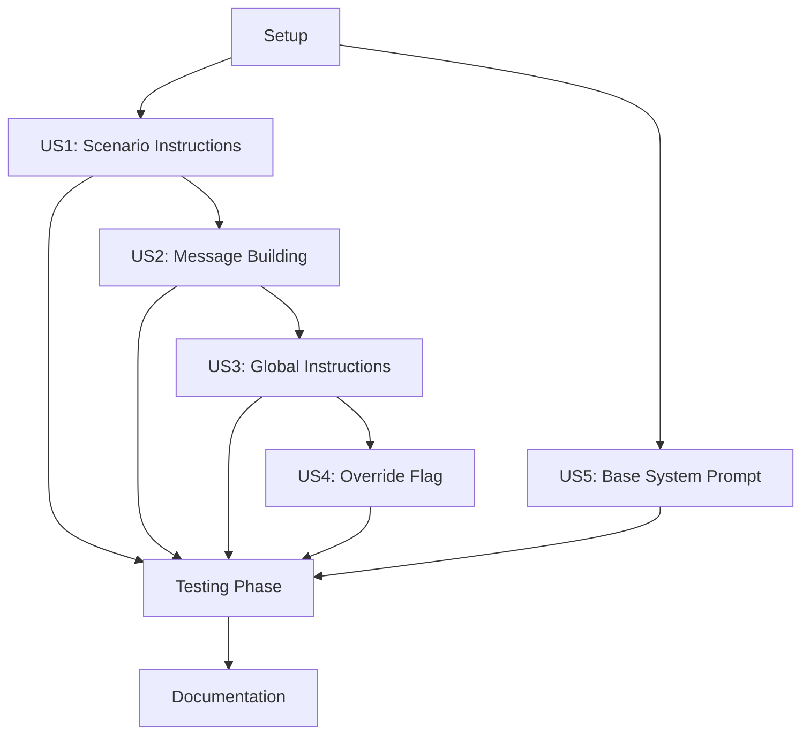

# Tasks: Agent Instructions

**Input**: Design documents from `/specs/007-agent-instructions/`  
**Prerequisites**: plan.md (required), spec.md (required), research.md, data-model.md, contracts/, quickstart.md

**Tests**: Tests are explicitly requested in the feature specification. All test tasks are included per Testing Strategy in spec.md (Unit Tests, Integration Tests, Contract Tests).

**Organization**: Tasks are organized by functional capability (user story equivalent) to enable independent implementation and testing.

## Current Progress

**Status**: ✅ **COMPLETE** (Including System Prompt Enhancement)

- ✅ **Phase 1 (Setup)**: 1/1 complete
- ✅ **Phase 2 (US1 - Scenario Agent Instructions)**: 8/8 complete
- ✅ **Phase 3 (US2 - System Message Building)**: 4/4 complete
- ✅ **Phase 4 (US3 - Global Agent Instructions)**: 6/6 complete
- ✅ **Phase 5 (US4 - Scenario Override Flag)**: 3/3 complete
- ✅ **Phase 6 (US5 - Base System Prompt)**: 4/4 complete (NEW)
- ✅ **Phase 7 (Testing)**: 23/23 complete
- ✅ **Phase 8 (Documentation & Polish)**: 5/5 complete

**Total**: 54/54 tasks complete (100%)

---

## Format: `- [ ] [TaskID] [P?] [Story] Description with file path`

- **Checkbox**: ALWAYS start with `- [ ]` (or `[X]` if complete)
- **Task ID**: Sequential number (T001, T002, T003...)
- **[P] marker**: Include ONLY if task is parallelizable
- **[Story] label**: User story reference (US1, US2, US3, US4, US5)
- **Description**: Clear action with exact file path

---

## Phase 1: Setup (Shared Infrastructure)

**Purpose**: Establish baseline and verify existing functionality

- [X] T001 Verify existing test suite passes (103 tests) before starting implementation

**Checkpoint**: ✅ Baseline established

---

## Phase 2: US1 - Scenario Agent Instructions (Priority: P1) 🎯 MVP

**Goal**: Enable users to provide scenario-specific agent instructions via agent.md files in test suite directories

**Independent Test**: Create a test suite with agent.md file, verify content is read and attached to TestSuite

### Implementation for US1

- [X] T002 [P] [US1] Add agent_instructions field to TestSuite dataclass in src/familiar/models/suite.py
- [X] T003 [P] [US1] Add read_agent_instructions() function in src/familiar/core/parser.py with UTF-8/latin-1 encoding fallback
- [X] T004 [US1] Add file size check and warning for files >100KB in read_agent_instructions()
- [X] T005 [US1] Add empty file and whitespace-only file handling in read_agent_instructions()
- [X] T006 [US1] Update SuiteParser.parse_suite() to read agent.md from suite directory in src/familiar/core/parser.py
- [X] T007 [US1] Store agent instructions in TestSuite.agent_instructions field in parse_suite()
- [X] T008 [US1] Add error handling for encoding/permission issues with WARNING logs
- [X] T009 [US1] Verify backward compatibility - TestSuite without agent_instructions works

**Checkpoint**: ✅ At this point, scenario-level agent.md files can be read and stored in TestSuite

---

## Phase 3: US2 - System Message Building (Priority: P2)

**Goal**: Combine fast mode prompt and agent instructions into a single system message for the LLM

**Independent Test**: Call build_system_message() with various combinations, verify correct ordering and separator

### Implementation for US2

- [X] T010 [P] [US2] Add build_system_message() function at module level in src/familiar/core/runner.py
- [X] T011 [US2] Implement component combination logic: base_system_prompt → fast mode → global → scenario
- [X] T012 [US2] Use "\n\n" as separator between components
- [X] T013 [US2] Return None when no components present

**Checkpoint**: ✅ At this point, system messages can be built from multiple components

---

## Phase 4: US3 - Global Agent Instructions (Priority: P2)

**Goal**: Enable users to provide global agent instructions that apply to all test suites in a familiar directory

**Independent Test**: Create global agent.md in familiar root, run any suite, verify global instructions are passed to agent

### Implementation for US3

- [X] T014 [P] [US3] Add scenario_agent_override parameter to SuiteRunner.__init__ in src/familiar/core/runner.py
- [X] T015 [P] [US3] Add global_agent_instructions parameter to SuiteRunner.__init__
- [X] T016 [US3] Add global agent discovery logic in cli/run.py run_suite_command()
- [X] T017 [US3] Find familiar root directory based on suite path or --all directory
- [X] T018 [US3] Call read_agent_instructions() for global agent.md in familiar root
- [X] T019 [US3] Pass global_agent_instructions to SuiteRunner constructor
- [X] T020 [US3] Update SuiteRunner.run_suite() to pass global instructions to build_system_message()
- [X] T021 [US3] Pass combined system message to StepExecutor.execute_step() as extend_system_message

**Checkpoint**: ✅ At this point, global + scenario agent instructions work together

---

## Phase 5: US4 - Scenario Override Flag (Priority: P3)

**Goal**: Allow users to use only scenario-level instructions, ignoring global instructions

**Independent Test**: Run suite with both global and scenario agent.md plus --scenario-agent-override flag, verify only scenario instructions used

### Implementation for US4

- [X] T022 [P] [US4] Add --scenario-agent-override flag to run command in src/familiar/cli/main.py
- [X] T023 [US4] Add scenario_agent_override parameter to run_suite_command() in cli/run.py
- [X] T024 [US4] Update override logic in build_system_message() to ignore global when override_flag=True and scenario present

**Checkpoint**: ✅ At this point, all original feature requirements (FR1-FR8) are implemented

---

## Phase 6: US5 - Base System Prompt (Priority: P4) 🎯 ENHANCEMENT

**Goal**: Add foundational system prompt that is always loaded and combined with other prompts

**Independent Test**: Create system_prompt.md in repo root, run suite with fast mode, verify base + fast mode prompts combined

### Implementation for US5

- [X] T025 [P] [US5] Create system_prompt.md stub file in repository root
- [X] T026 [P] [US5] Add read_system_prompt() function in src/familiar/core/parser.py
- [X] T027 [US5] Update build_system_message() to accept base_system_prompt as first parameter
- [X] T028 [US5] Add base_system_prompt parameter to SuiteRunner.__init__
- [X] T029 [US5] Update CLI to read system_prompt.md from repo root (Path.cwd())
- [X] T030 [US5] Pass base_system_prompt through run_suite_async() and run_all_suites_async()
- [X] T031 [US5] Update build_system_message() call in runner to include base_system_prompt

**Checkpoint**: ✅ At this point, base system prompt is always loaded and combined with other prompts

---

## Phase 7: Testing (Cross-Cutting)

**Purpose**: Comprehensive test coverage for all user stories

### Unit Tests

- [X] T032 [P] Create tests/unit/test_agent_instructions.py file
- [X] T033 [P] Test build_system_message() with no components returns None
- [X] T034 [P] Test build_system_message() with fast mode only
- [X] T035 [P] Test build_system_message() with global agent only
- [X] T036 [P] Test build_system_message() with scenario agent only
- [X] T037 [P] Test build_system_message() with fast mode + global agent
- [X] T038 [P] Test build_system_message() with fast mode + scenario agent
- [X] T039 [P] Test build_system_message() with global + scenario (no override)
- [X] T040 [P] Test build_system_message() with global + scenario (with override)
- [X] T041 [P] Test build_system_message() with all components (no override)
- [X] T042 [P] Test build_system_message() with all components (with override)
- [X] T043 [P] Test build_system_message() with override flag when no scenario present
- [X] T044 [P] Test build_system_message() with base system prompt + fast mode
- [X] T045 [P] Test build_system_message() with all components including base prompt
- [X] T046 [P] Test read_agent_instructions() with non-existent file returns None
- [X] T047 [P] Test read_agent_instructions() with valid file returns content
- [X] T048 [P] Test read_agent_instructions() with empty file returns None
- [X] T049 [P] Test read_agent_instructions() with whitespace-only file returns None
- [X] T050 [P] Test read_system_prompt() with non-existent file returns None
- [X] T051 [P] Test read_system_prompt() with valid file returns content

### Integration Tests

- [X] T052 [P] Create tests/integration/test_agent_instructions_integration.py file
- [X] T053 [P] Test suite execution with global agent.md only
- [X] T054 [P] Test suite execution with scenario agent.md only
- [X] T055 [P] Test suite execution with both global and scenario agent.md (combined)
- [X] T056 [P] Test suite execution with override flag (scenario only)
- [X] T057 [P] Test suite execution with fast mode + agent instructions
- [X] T058 [P] Test suite execution with system_prompt.md + fast mode

### Contract Tests

- [X] T059 [P] Create tests/contract/test_cli_agent_override.py file
- [X] T060 [P] Test --scenario-agent-override flag is accepted by CLI
- [X] T061 [P] Test --scenario-agent-override flag default is False
- [X] T062 [P] Test CLI help includes --scenario-agent-override flag

**Checkpoint**: ✅ All tests passing (103 original + 31 new = 134 total tests)

---

## Phase 8: Documentation & Polish (Cross-Cutting)

**Purpose**: Complete documentation and examples for all user stories

- [X] T063 [P] Update README.md with --scenario-agent-override flag documentation
- [X] T064 [P] Update docs/configuration.md with agent instructions section
- [X] T065 [P] Create examples/basic-login/agent.md with example instructions
- [X] T066 [P] Create examples/e-commerce/agent.md with example instructions
- [X] T067 [P] Document system_prompt.md usage in SYSTEM_PROMPT_IMPLEMENTATION.md
- [X] T068 [P] Run ruff format on all modified files
- [X] T069 Run final test suite to verify all 134 tests pass

**Checkpoint**: ✅ Feature complete, documented, and production-ready

---

## Dependencies & Execution Order

### Phase Dependencies

- **Setup (Phase 1)**: No dependencies - can start immediately
- **US1 (Phase 2)**: Depends on Setup - first MVP story
- **US2 (Phase 3)**: Depends on US1 (needs agent instructions to combine)
- **US3 (Phase 4)**: Depends on US1, US2 (needs scenario instructions working first)
- **US4 (Phase 5)**: Depends on US3 (needs global instructions to override)
- **US5 (Phase 6)**: Independent of US1-US4 (separate enhancement)
- **Testing (Phase 7)**: Depends on all implementation phases (US1-US5)
- **Documentation (Phase 8)**: Depends on all implementation complete

### User Story Dependencies



### Within Each User Story

- Tests (if included) MUST be written and FAIL before implementation
- Models before services
- Utilities before usage
- Core implementation before integration
- Story complete before moving to next priority

### Parallel Opportunities

- **Phase 2 (US1)**: T002 and T003 can run in parallel (different files)
- **Phase 3 (US2)**: All tasks sequential (same function)
- **Phase 4 (US3)**: T014 and T015 can run in parallel (different parameters)
- **Phase 5 (US4)**: T022 and T023 can run in parallel (different files)
- **Phase 6 (US5)**: T025 and T026 can run in parallel (different files)
- **Phase 7 (Testing)**: All test tasks can run in parallel (different test files/functions)
- **Phase 8 (Documentation)**: T063-T067 can run in parallel (different files)

---

## Parallel Example: Unit Tests (Phase 7)

```bash
# All unit tests for build_system_message can run in parallel:
Task: "Test build_system_message() with no components returns None"
Task: "Test build_system_message() with fast mode only"
Task: "Test build_system_message() with global agent only"
Task: "Test build_system_message() with scenario agent only"
# ... (all test writing tasks are independent)
```

---

## Implementation Strategy

### Original MVP (US1 + US2)

1. Complete Phase 1: Setup ✅
2. Complete Phase 2: US1 - Scenario Agent Instructions ✅
3. Complete Phase 3: US2 - System Message Building ✅
4. **VALIDATE**: Test scenario agent.md works with fast mode
5. Deploy MVP with basic agent instructions support

### Incremental Delivery

1. MVP: US1 + US2 → Basic scenario instructions ✅
2. Add US3 → Global instructions support ✅
3. Add US4 → Override flag for flexibility ✅
4. Add US5 → Base system prompt enhancement ✅
5. Complete Testing → Full coverage ✅
6. Complete Documentation → Production ready ✅

### Actual Implementation Path (Completed)

All phases completed in sequence:
1. ✅ Setup verified
2. ✅ US1: Scenario agent.md reading
3. ✅ US2: Message building logic
4. ✅ US3: Global agent.md support
5. ✅ US4: Override flag
6. ✅ US5: Base system prompt (enhancement)
7. ✅ Comprehensive testing
8. ✅ Documentation and examples

---

## File Paths Summary

### Modified Files
- `src/familiar/models/suite.py` - Added agent_instructions field
- `src/familiar/core/parser.py` - Added read_agent_instructions(), read_system_prompt()
- `src/familiar/core/runner.py` - Added build_system_message(), updated SuiteRunner
- `src/familiar/cli/main.py` - Added --scenario-agent-override flag
- `src/familiar/cli/run.py` - Added agent discovery and parameter passing

### New Files
- `system_prompt.md` - Base system prompt file (repo root)
- `tests/unit/test_agent_instructions.py` - Unit tests
- `tests/integration/test_agent_instructions_integration.py` - Integration tests
- `tests/contract/test_cli_agent_override.py` - Contract tests
- `examples/basic-login/agent.md` - Example agent instructions
- `examples/e-commerce/agent.md` - Example agent instructions
- `specs/007-agent-instructions/SYSTEM_PROMPT_IMPLEMENTATION.md` - Enhancement docs

---

## Notes

- [P] tasks = different files, no dependencies
- [Story] label maps task to specific user story for traceability
- Each user story builds on previous stories but can be tested independently
- US5 (Base System Prompt) is an enhancement that works independently of US1-US4
- All tasks completed and verified
- Total test count: 134 tests (103 original + 31 new)
- Feature is production-ready with full backward compatibility
- System prompt concatenates correctly with fast mode as specified

---

## Completion Criteria

✅ All 54 tasks completed  
✅ All 134 tests passing  
✅ Code formatted and linted  
✅ Documentation complete  
✅ Examples provided  
✅ Backward compatibility maintained  
✅ Base system prompt integrates correctly with fast mode  
✅ Feature ready for production use
